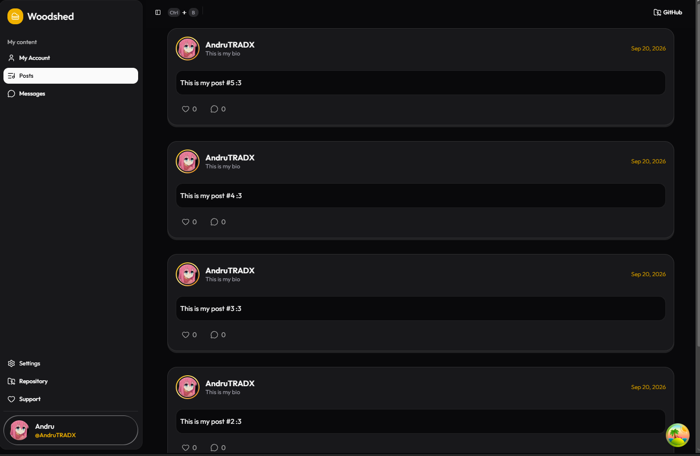
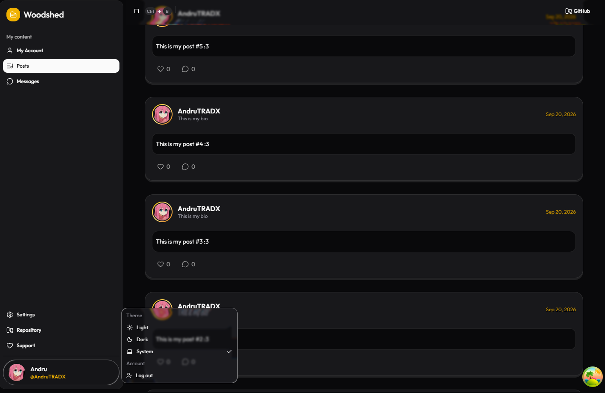

<h1 align="center">Woodshed</h1>

  <em>Share your music, get feedback, and connect with other musicians, all in one place.</em>

  
  
  
  
  

---

# What is Woodshed?

Woodshed is a platform for all musicians, where they can share their content, get feedback, interact, and connect, all in one place.

In musician slang, *to woodshed* means to lock yourself in the practice room and work on your craft. This project wants to be that place for musicians all over the world, made with love for the people who inspire us with their passion for music.

## Features

- **Musician profiles**: unique nicknames and the instruments you play.
- **Posts**: share your content with the community.
- **Comments and likes**: get feedback on what you share.
- **Messages**: talk directly with other musicians.
- **Email-based login**: with cookie or bearer token support.
- **Piano-inspired interface with sound effects**: an app that feels like a place you can live in.

## In development

Woodshed is in active development, and in my spare time I will keep updating the repository with more functionalities.

Right now I'm just building the walking skeleton: the base on which the whole project will be built, including the core functionality, the architecture, and all that.

## Tech stack

| Area | Technologies |
| --- | --- |
| **Backend** | C#, .NET, ASP.NET Identity, Entity Framework Core, SQL Server |
| **Architecture** | Clean Architecture, MediatR, AutoMapper, Repository + Unit of Work |
| **Frontend** | React, TypeScript, React Router, shadcn/ui on Radix UI |

## Design philosophy

Woodshed tries to resemble an actual piano, because I want it to be a personalized experience for musicians. The idea is to have an interface that feels responsive and alive when performing actions.

You can read more about the why and how in the [DEV Notes](DEV_NOTES.md).

## Relational model v0.0.1

## More content

- [FAQ](FAQ.md)
- [DEV Notes](DEV_NOTES.md): insights on how and why things were built the way they were.

---

  I hope you folks enjoy it as much as I'm enjoying making it &lt;3

